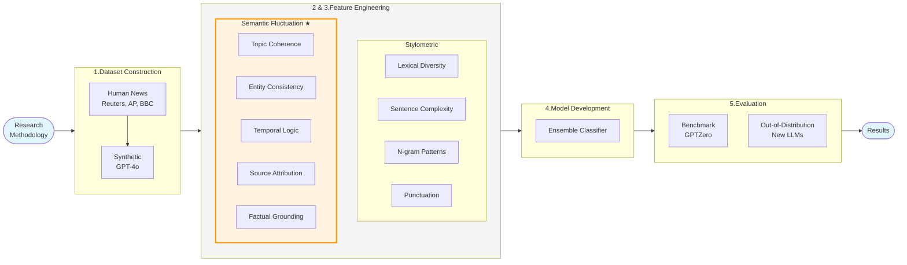

# Research Methodology Diagram (16:9 Format)



## Visualization Instructions

To view this diagram:

1. **GitHub/GitLab**: View this markdown file directly - Mermaid is natively supported
2. **VS Code**: Install "Markdown Preview Mermaid Support" extension
3. **Online**: Copy the mermaid code to https://mermaid.live/
4. **Export**: Use mermaid-cli to export as PNG/SVG:
   ```bash
   mmdc -i research_methodology.md -o methodology_diagram.png -w 1920 -H 1080
   ```

## Diagram Key

- **Blue boxes**: Start/End points
- **Orange highlighted box with ★**: Novel contribution (Semantic Fluctuation Analysis)
- **Horizontal flow**: Optimized for 16:9 presentation format
- **5 main stages**: Dataset → Features → Model → Evaluation → Results
